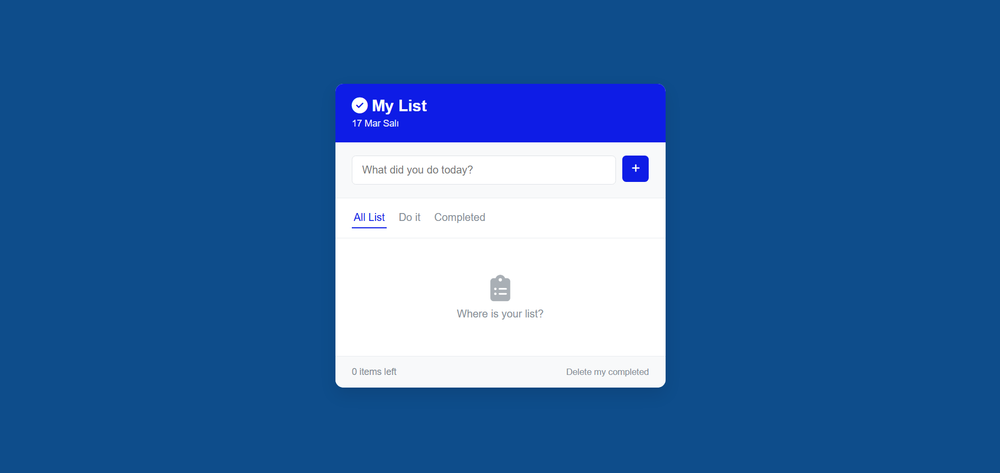
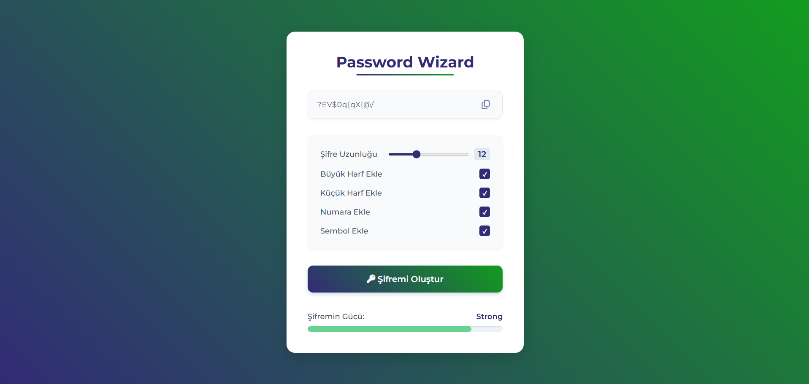
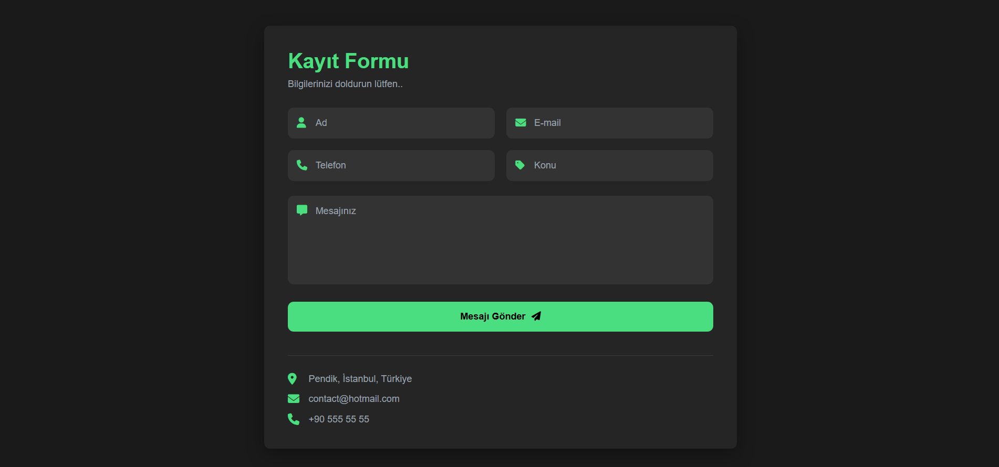

# 🚀 Frontend Mini Projeler

JavaScript, HTML5 ve CSS3 kullanılarak geliştirilmiş, modern web geliştirme temellerini barındıran fonksiyonel web projeleri koleksiyonu.

Bu depo; DOM manipülasyonu, veri yönetimi ve tarayıcı depolama (LocalStorage) gibi temel JavaScript konseptlerini gerçek dünya senaryolarıyla uygulamalı olarak sergilemek amacıyla oluşturulmuştur. Herhangi bir kütüphane veya framework kullanılmadan, tamamen saf JavaScript mimarisiyle inşa edilmiştir.

## 🗂️ Proje Kataloğu

Aşağıdaki tabloda, bu depo altında geliştirilen projelerin listesini, odaklanılan teknolojileri ve kaynak kodlarına giden bağlantıları bulabilirsiniz. (Yeni projeler tamamlandıkça bu liste güncellenecektir.)

| # | Proje Adı | Odaklanılan Konular / Teknolojiler | Kaynak Kod | Canlı Demo | Durum |
| :---: | :--- | :--- | :---: | :---: | :---: |
| **01** | **To-Do List** | `DOM Events`, `LocalStorage`, `Array Methods` | [📂 İncele](./ToDo-List) | [🚀 Önizle](https://mertkanfe.github.io/frontend-mini-projects/ToDo-List/) | ✅ Tamamlandı |
| **02** | **Password Wizard** | `String Methods`, `Math.random()`, `Clipboard API` | [📂 İncele](./Password-Wizard) | [🚀 Önizle](https://mertkanfe.github.io/frontend-mini-projects/Password-Wizard/) | ✅ Tamamlandı |
| **03** | **Registration Form** | `Form Validation`, `Regex`, `Custom Error Messages` | [📂 İncele](./Registration-Form) | [🚀 Önizle](https://mertkanfe.github.io/frontend-mini-projects/Registration-Form/) | ✅ Tamamlandı |

### 🖼️ Proje Ekran Görüntüleri

#### 01. To-Do List


#### 02. Password Wizard


#### 03. Registration Form


## 🛠️ Temel Özellikler ve Prensipler

Bu projedeki kod mimarisi kurgulanırken şu standartlara dikkat edilmiştir:
- **Semantik HTML:** Anlamlı etiket kullanımı ile erişilebilirlik (A11y) ve okunabilirlik sağlandı.
- **Temiz Kod (Clean Code):** Anlaşılır değişken isimlendirmeleri yapıldı ve kod tekrarlarından (DRY prensibi) kaçınıldı.
- **Responsive Tasarım:** Esnek yapılar kullanılarak farklı ekran boyutlarına uyumlu arayüzler tasarlandı.
- **Veri Kalıcılığı:** Tarayıcı hafızası (LocalStorage) kullanılarak sayfa yenilense bile verilerin kaybolmaması sağlandı.

## 💻 Nasıl Çalıştırılır?

Bu depodaki herhangi bir projeyi yerel bilgisayarınızda çalıştırmak için:

1. Depoyu klonlayın:
   ```bash
   git clone [https://github.com/mertkanfe/frontend-mini-projects.git](https://github.com/mertkanfe/frontend-mini-projects.git)