# 🚀 Frontend Mini Projeler

JavaScript, HTML5 ve CSS3 kullanılarak geliştirilmiş, modern web geliştirme temellerini barındıran fonksiyonel web projeleri koleksiyonu.

Bu depo; DOM manipülasyonu, veri yönetimi ve tarayıcı depolama (LocalStorage) gibi temel JavaScript konseptlerini gerçek dünya senaryolarıyla uygulamalı olarak sergilemek amacıyla oluşturulmuştur. Herhangi bir kütüphane veya framework kullanılmadan, tamamen saf JavaScript mimarisiyle inşa edilmiştir.

## 🗂️ Proje Kataloğu

Aşağıdaki tabloda, bu depo altında geliştirilen projelerin listesini, odaklanılan teknolojileri ve kaynak kodlarına giden bağlantıları bulabilirsiniz. (Yeni projeler tamamlandıkça bu liste güncellenecektir.)

| # | Proje Adı | Odaklanılan Konular / Teknolojiler | Kaynak Kod | Canlı Demo |
| :---: | :--- | :--- | :---: | :---: |
| **01** | **To-Do List** | `DOM Events`, `LocalStorage`, `Array Methods` | [📂 İncele](./ToDo-List) | [🚀 Önizle](https://mertkanfe.github.io/frontend-mini-projects/ToDo-List/)
| **02** | **Password Wizard** | `String Methods`, `Math.random()`, `Clipboard API` | [📂 İncele](./Password-Wizard) | [🚀 Önizle](https://mertkanfe.github.io/frontend-mini-projects/Password-Wizard/)
| **03** | **Registration Form** | `Form Validation`, `Regex`, `Custom Error Messages` | [📂 İncele](./Registration-Form) | [🚀 Önizle](https://mertkanfe.github.io/frontend-mini-projects/Registration-Form/)
| **04** | **Color Generator** | `DOM Manipulation`, `Hex/RGB Colors`, `Event Listeners` | [📂 İncele](./Color-Generator) | [🚀 Önizle](https://mertkanfe.github.io/frontend-mini-projects/Color-Generator/)
| **05** | **Currency Exchange** | `Fetch API`, `Async/Await`, `JSON` | [📂 İncele](./Currency-Exchange) | [🚀 Önizle](https://mertkanfe.github.io/frontend-mini-projects/Currency-Exchange/)
| **06** | **Expenses Report** | `Object Manipulation`, `Dynamic Rendering`, `Math Calculation` | [📂 İncele](./Expenses-Report) | [🚀 Önizle](https://mertkanfe.github.io/frontend-mini-projects/Expenses-Report/)
| **07** | **Newsletter Design** | `CSS Grid / Flexbox`, `Responsive Design`, `Form UI` | [📂 İncele](./Newsletter-Design) | [🚀 Önizle](https://mertkanfe.github.io/frontend-mini-projects/Newsletter-Design/)
| **08** | **Example Form** | `HTML Forms`, `Input Styling`, `CSS Layouts` | [📂 İncele](./Example-Form) | [🚀 Önizle](https://mertkanfe.github.io/frontend-mini-projects/Example-Form/)
| **09** | **Bookmark** | `URL Validation`, `LocalStorage`, `DOM Manipulation` | [📂 İncele](./Bookmark) | [🚀 Önizle](https://mertkanfe.github.io/frontend-mini-projects/Bookmark/)
| **10** | **Support Page** | `FAQ Layout`, `CSS Transitions`, `User Interaction` | [📂 İncele](./Support-Page) | [🚀 Önizle](https://mertkanfe.github.io/frontend-mini-projects/Support-Page/)
| **11** | **Subscriptions** | `Pricing UI`, `Toggle Switch`, `Flexbox Layout` | [📂 İncele](./Subscriptions) | [🚀 Önizle](https://mertkanfe.github.io/frontend-mini-projects/Subscriptions/)
| **12** | **Page 404** | `CSS Animations`, `Responsive Design`, `Error Handling UI` | [📂 İncele](./Page-404) | [🚀 Önizle](https://mertkanfe.github.io/frontend-mini-projects/Page-404/)
| **13** | **Colleagues** | `Card UI Design`, `List Rendering`, `Profile Layouts` | [📂 İncele](./Colleagues) | [🚀 Önizle](https://mertkanfe.github.io/frontend-mini-projects/Colleagues/)
| **14** | **Scroll Loading Percentage** | `Scroll Events`, `Progress Bar UI`, `Viewport Calculations` | [📂 İncele](./Scroll-Loading-Percentage) | [🚀 Önizle](https://mertkanfe.github.io/frontend-mini-projects/Scroll-Loading-Percentage/)
| **15** | **Quiz Game** | `Logic Design`, `State Management`, `Dynamic UI Rendering` | [📂 İncele](./Quiz-Game) | [🚀 Önizle](https://mertkanfe.github.io/frontend-mini-projects/Quiz-Game/)

### 🖼️ Proje Ekran Görüntüleri

#### 01. To-Do List


#### 02. Password Wizard


#### 03. Registration Form


#### 04. Color Generator
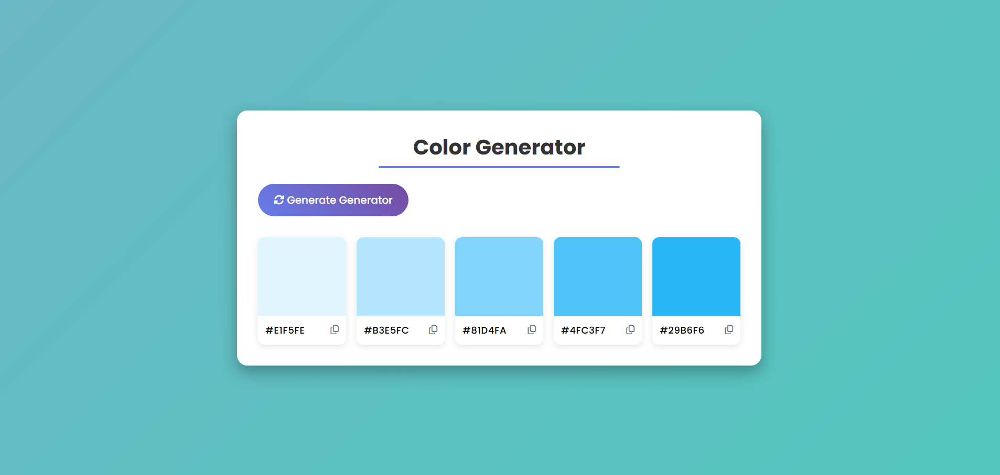

#### 05. Currency Exchange
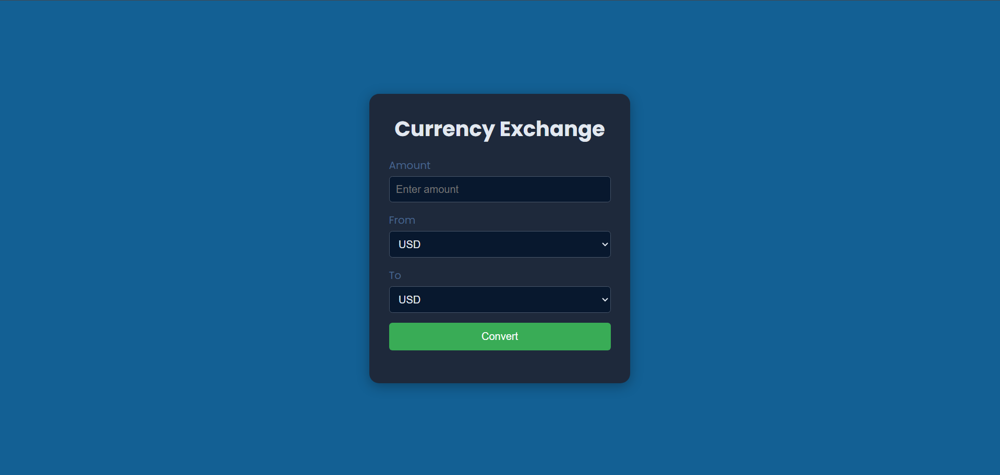

#### 06. Expenses Report
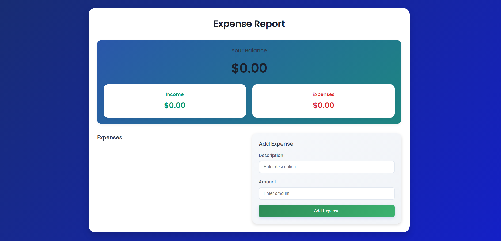

#### 07. Newsletter Design
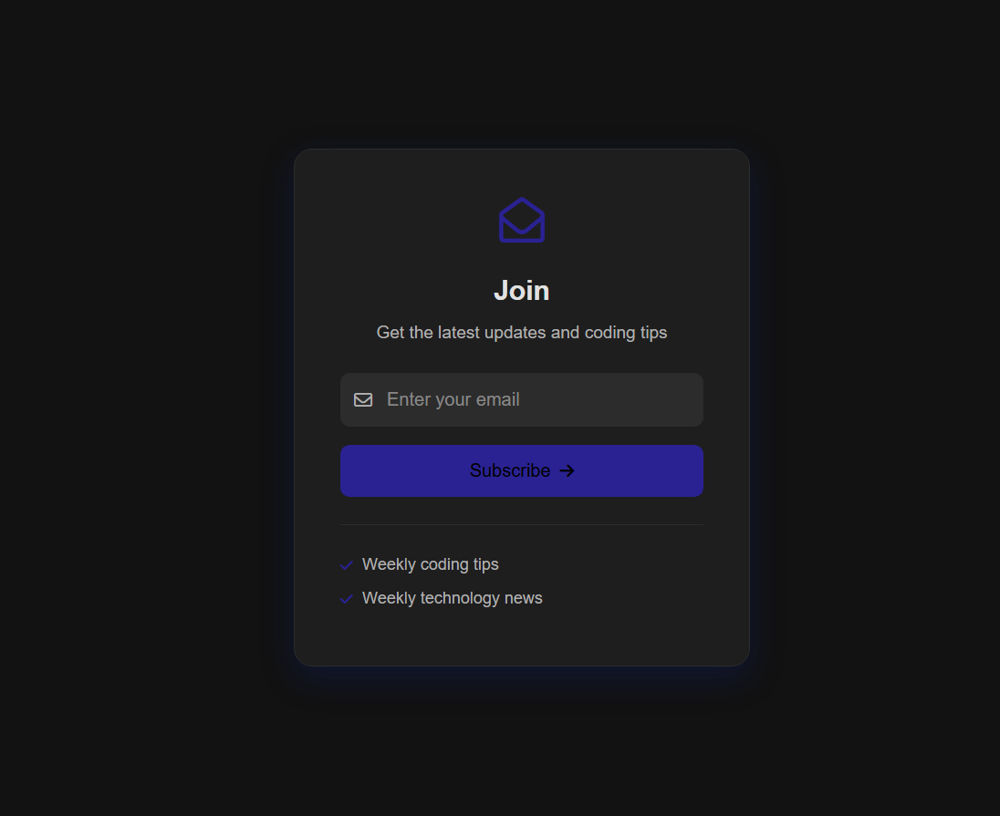

#### 08. Example Form
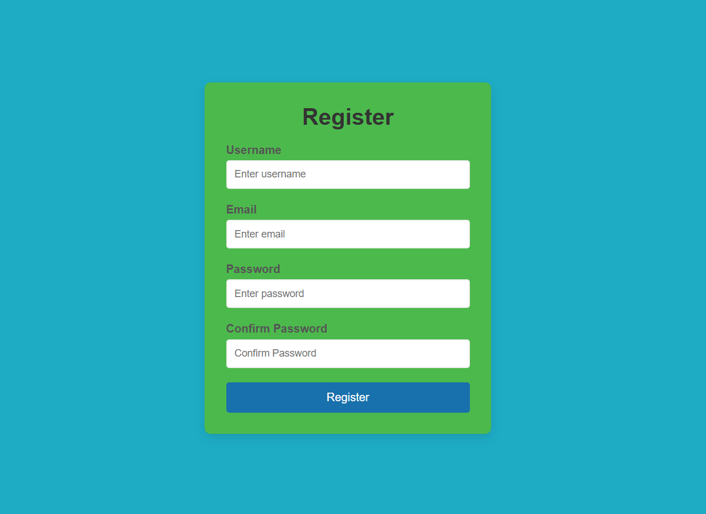

#### 09. Bookmark
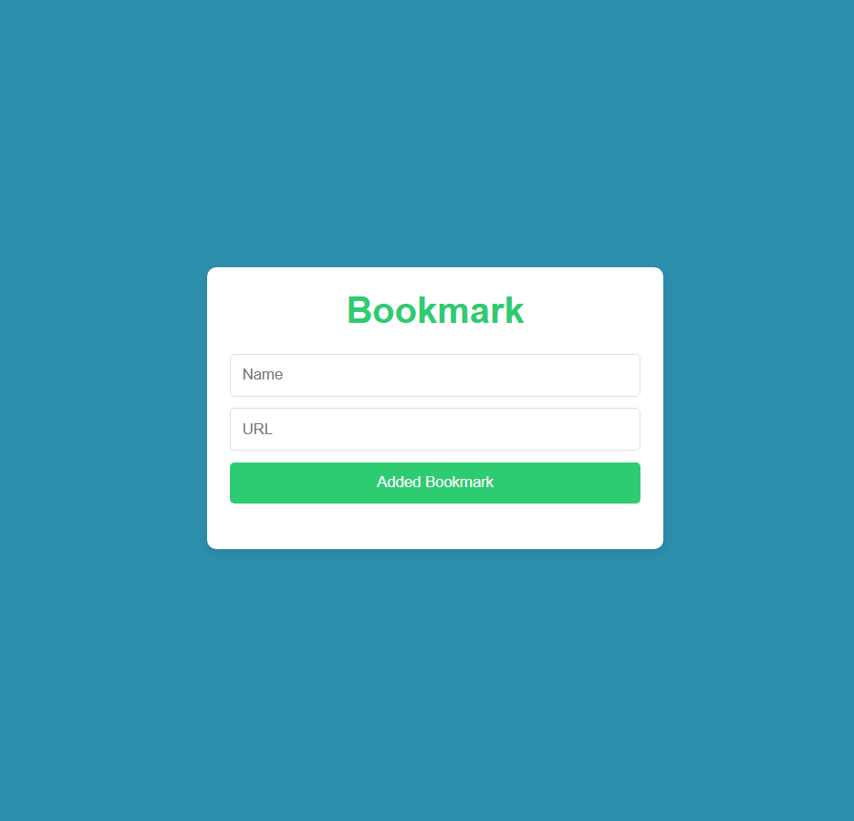

#### 10. Support Page
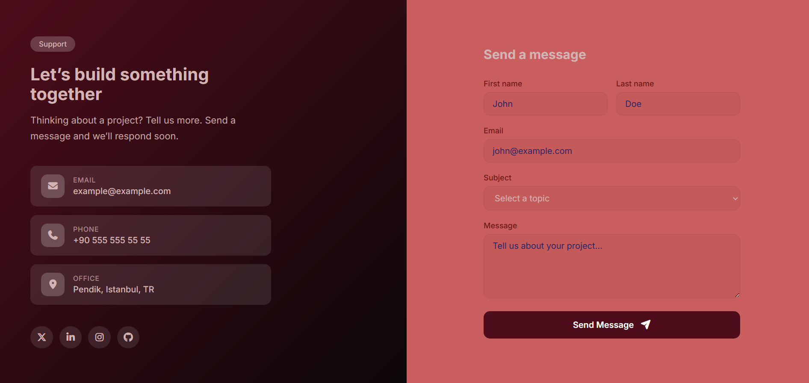

#### 11. Subscriptions
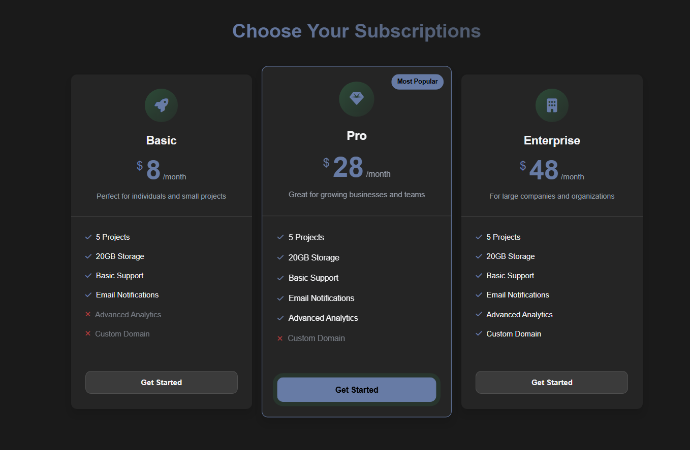

#### 12. Page 404
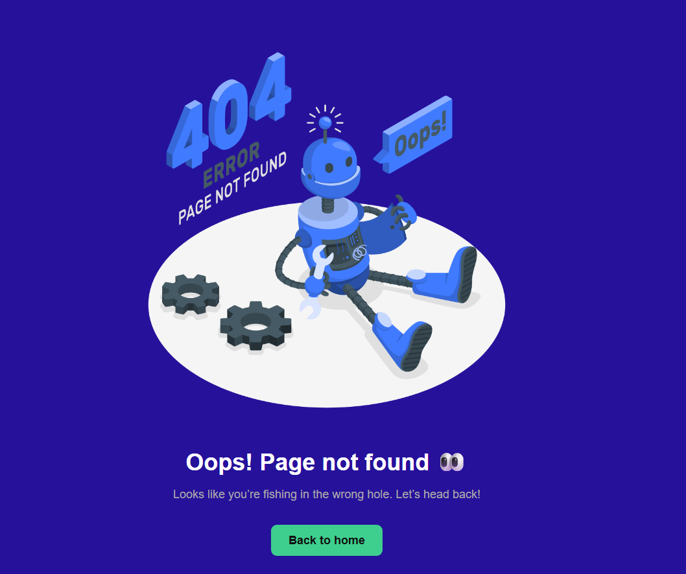

#### 13. Colleagues
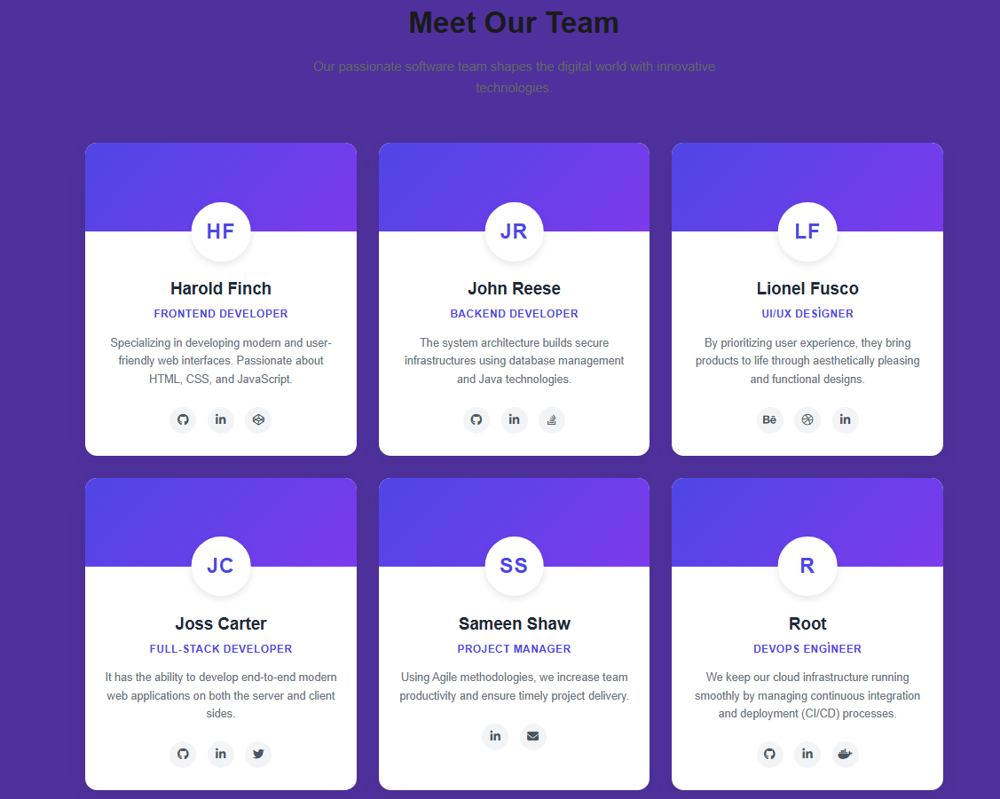

#### 14. Scroll Loading Percentage
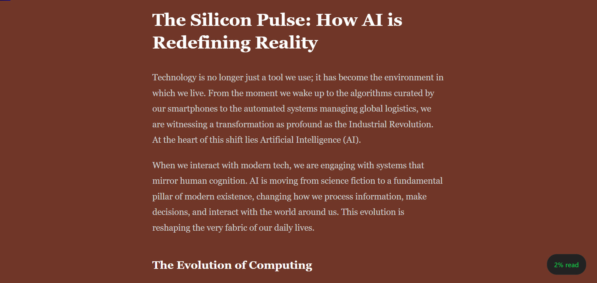

#### 15. Quiz Game
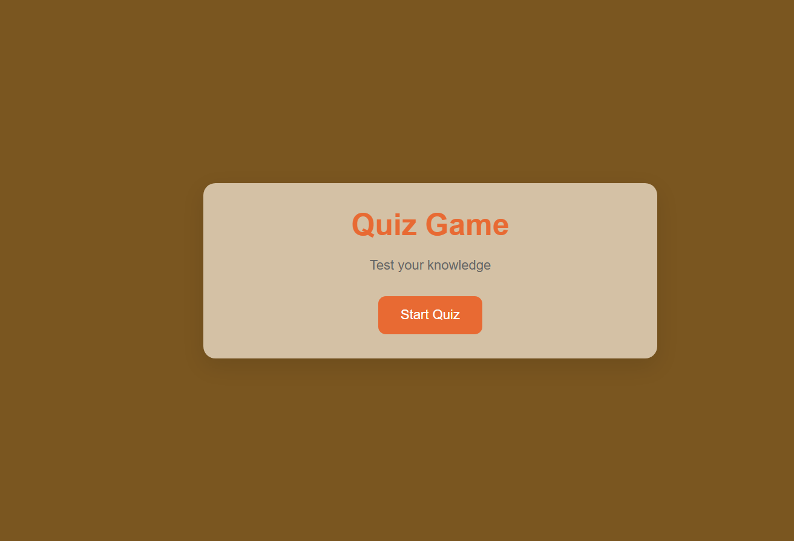

## 🛠️ Temel Özellikler ve Prensipler

Bu projedeki kod mimarisi kurgulanırken şu standartlara dikkat edilmiştir:
- **Semantik HTML:** Anlamlı etiket kullanımı ile erişilebilirlik (A11y) ve okunabilirlik sağlandı.
- **Temiz Kod (Clean Code):** Anlaşılır değişken isimlendirmeleri yapıldı ve kod tekrarlarından (DRY prensibi) kaçınıldı.
- **Responsive Tasarım:** Esnek yapılar kullanılarak farklı ekran boyutlarına uyumlu arayüzler tasarlandı.
- **Veri Kalıcılığı:** Tarayıcı hafızası (LocalStorage) kullanılarak sayfa yenilense bile verilerin kaybolmaması sağlandı.

## 💻 Nasıl Çalıştırılır?

Bu depodaki herhangi bir projeyi yerel bilgisayarınızda çalıştırmak için:

1. Depoyu klonlayın:
   ```bash
   git clone [https://github.com/mertkanfe/frontend-mini-projects.git](https://github.com/mertkanfe/frontend-mini-projects.git)